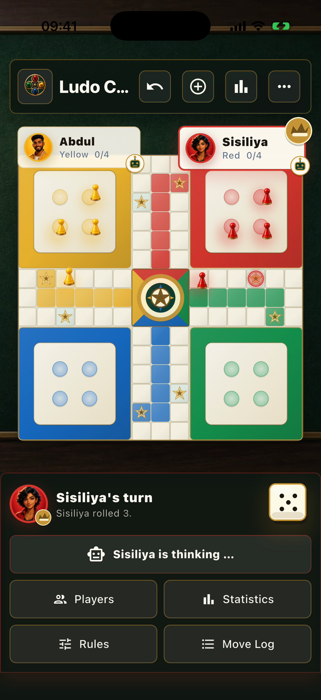

# Ludo Club

Ludo Club is a Flutter Ludo game for local 2-4 player matches. Rules and bot
selection are kept outside the widgets, while the UI uses Material 3 and a
custom-painted 15x15 board across phones, browsers, and desktop windows.

## Product demo

[](docs/demo/board-magic-demo.mp4)

**[Watch the 50-second product demo](docs/demo/board-magic-demo.mp4).** It shows
a local two-bot match, the Club rules preset and live match statistics. No
account, network service or private data is used.

## Features

- Human and computer-controlled seats with editable names and fictional avatars
- Easy, normal, and hard bots: random play, tactical priorities, and additional
  capture-risk/look-ahead scoring respectively
- Configurable opening rolls, base-exit priority, own-field blocks, exact
  finishes, capture/finish bonuses, third-six penalties, and capture priority
- Move targets and explanations, undo, a bounded move log, and automatic play
  when only one legal move exists
- Persistent current-match and per-player statistics: rolls, moves, captures,
  sixes, elapsed time, wins, and up to 50 completed-match records
- Automatic local save/resume of the current match and bounded undo history,
  plus a visible clear-save action
- Sound effects and haptics with independent toggles
- Reduced-motion support that also honors the operating system preference
- German, English, or system-language selection
- Private room-code matches through the bundled authoritative WebSocket server,
  including reconnects, host-controlled rematches, and paused turns when a
  player disconnects
- Responsive board layouts, mobile action sheets, keyboard/screen-reader
  semantics, and large touch targets
- Compressed WebP backgrounds and textures; all bundled assets total about
  1.1 MB instead of the previous 17.1 MB

## Architecture

- `lib/logic/` contains deterministic rules, geometry, and bot strategy.
- `lib/models/` contains immutable, backward-compatible JSON state models.
- `lib/providers/` coordinates turns, bots, undo, and persistence.
- `lib/services/` owns app preferences, feedback, and game storage.
- `lib/online/` contains the versioned room protocol, reconnecting client, and
  authoritative in-memory room server.
- `lib/ui/` and `lib/widgets/` contain responsive presentation components.
- `test/` mirrors the production boundaries with logic, model, provider,
  service, and widget tests.

Game persistence is serialized in call order. Each operation gets a revision,
so an older slow write cannot overwrite or clear newer state. `flush()` waits
for every revision queued before it and reports a failure of the latest write.
Synchronous `dispose()` rejects new work but leaves already queued operations
running; an asynchronous application lifecycle hook should await `flush()`
when it must guarantee durability before shutdown returns.

## Development

```sh
flutter pub get
dart format --output=none --set-exit-if-changed .
flutter analyze
flutter test
flutter run -d chrome
```

Useful build checks:

```sh
flutter build web --release
flutter build apk --debug
flutter build ios --debug --no-codesign
```

## Private online rooms

Start the bundled development room server in a second terminal:

```sh
dart run bin/room_server.dart
```

The app uses `ws://127.0.0.1:8080/ws` by default. To test with phones on a
trusted local network, expose the server deliberately and enter the computer's
reachable LAN address in the room sheet:

```sh
LUDO_ROOM_HOST=0.0.0.0 dart run bin/room_server.dart
```

For a hosted build, configure the app at compile time:

```sh
flutter build web --release \
  --dart-define=LUDO_ROOM_SERVER=wss://games.example.com/ws
```

The bundled server keeps rooms only in memory. It defaults to loopback and is
intended for local development or deployment behind a TLS reverse proxy with
origin checks and rate limiting. A room code is an invitation token, not an
account system; do not expose the raw `ws://` server directly to the internet.

Android commands require a configured Android SDK. iOS commands require Xcode
and CocoaPods on macOS.

## Android release signing

1. Create or obtain a private upload keystore. Keep it outside the repository.
2. Copy `android/key.properties.example` to `android/key.properties`.
3. Replace every placeholder. `storeFile` may be an absolute path or a path
   relative to `android/`.
4. Build the signed Play Store bundle with `flutter build appbundle --release`.

`android/key.properties`, `*.jks`, and `*.keystore` are ignored. The Gradle
configuration never falls back to the debug certificate for release builds.

## CI

GitHub Actions installs dependencies, checks formatting, analyzes the project,
runs the full test suite with coverage, and performs an Android debug smoke
build. Pushes to `main` additionally build and retain the release web bundle.

Generated folders such as `.dart_tool/`, `build/`, and `coverage/` remain
untracked. Use `flutter clean` when a local platform build needs a clean slate.
